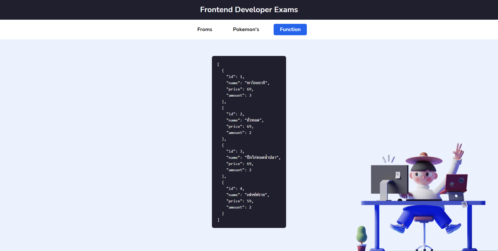

# วิธีการส่งข้อสอบ

1. อัพ Code ขึ้น GitHub ของตัวเอง
2. Deploy Code ขึ้น Hosting ที่ไหนก็ได้
3. ส่ง Link GitHub และ Link Website ที่อัพขึ้น Hosting แล้วมาทาง **Email: suphakon@owldayhouse.com**

# Frontend Developer Exams

- สามารถใช้ Vue, React, Angular หรือ Framework ใดๆ ในการทำข้อสอบได้ ***(หากเป็นไปได้อยากให้ใช้ React)***
- สามารถใช้ CSS Framework หรือ custom CSS เองได้

## Requirement

1. สร้าง form และ validate ข้อมูล
2. ดึงข้อมูลจาก pokemon's api และแสดงผล
3. แก้ปัญหาการดึงข้อมูลจาก data.json

## Route to display result

    |-- Form and validation
    |-- Fetch Pokemon's API
    |-- Solve query data

### 1. Form and validation

- ### สร้าง form สำหรับกรอกข้อมูล ดังตัวอย่าง
  
- ### validate inputs ข้อมูลแต่ละชนิดให้ถูกต้อง หากไม่ถูกต้องให้แจ้งเตือน
  
- ### เมื่อ validate form ผ่านให้แสดงผลลัพท์ดังตัวอย่างด้านล่าง
  

### 2. Fetch Pokemon's API

- ### สร้าง placeholder หรือ skeleton สำหรับการรอ fetch data
  
- ### fetch pokemon's data จาก `https://pokeapi.co/api/v2`
- #### ดึงข้อมูลของ pokemon แต่ละตัวผ่าน api ex. GET-> https://pokeapi.co/api/v2/pokemon/1
- #### ดึงข้อมูลของ pokemon id ที่ 1-104 แล้วนำมาแสดงในหน้ารวม
  
- #### ให้แสดง ชื่อ,รูป ของ pokemon เท่านั้น และแสดง แถวละ 6 ตัว ดังตัวอย่าง
  

### 3. Solve query data

#### \*ใช้ข้อมูลจาก json ที่แนบไว้กับ github -> data.json

จากข้อมูลจะเป็นตัวอย่างการสั่งรายการอาหาร
ให้ **filter** เฉพาะร้านค้า `1` แล้วทำการรวมจำนวนรายการอาหารที่ถูกสั่ง

- key สำหรับอาหารคือ `data`
- key สำหรับจำนวนรายการอาหารที่ถูกสั่ง `data > order > amount`

- #### แสดงผลตามตัวอย่างด้านล่าง

